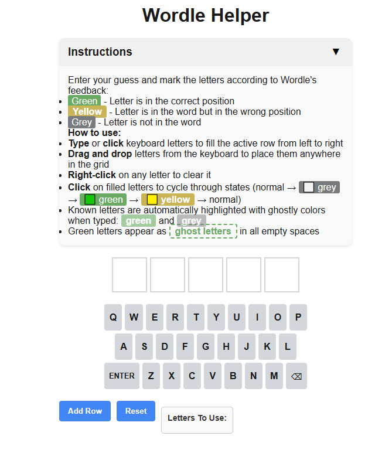

# Wordle Helper

A browser-based tool to help track and visualize your Wordle guesses. This is not a standalone Wordle game, but rather a companion tool to use alongside the official Wordle game.



## Features

- **Multiple Input Methods**:
  - Type letters using your keyboard
  - Click letters on the on-screen keyboard
  - Drag and drop letters from keyboard to grid
  - Right-click to clear any letter

- **Smart Letter Tracking**:
  - Letters cycle through states when clicked: normal → grey → green → yellow → normal
  - Automatic ghost letters show correct positions in empty spaces
  - Auto-highlighting of known letters as you type with ghostly styles

- **User Experience Improvements**:
  - Collapsible instructions (state is saved between sessions)
  - One-time disclaimer popup on first visit
  - Visual hints show where letters belong
  - "Letters To Use" section shows which yellow letters need placement

- **Behind The Scenes**:
  - All user preferences saved in localStorage
  - No server-side dependencies
  - Responsive design for different screen sizes

## How To Use

1. Open the `index.html` file in your web browser
2. Type your Wordle guesses or drag letters into position
3. Click on letters to cycle through states:
   - Grey (⬜): Letter is not in the word
   - Green (🟩): Letter is in the correct position
   - Yellow (🟨): Letter is in the word but wrong position
4. Use the "Add Row" button to add additional guess rows if needed
5. Use "Reset" to clear the board and start over

## Visual Guide to Letter States

- **Green letters** indicate correct position
- **Yellow letters** indicate correct letter but wrong position
- **Grey letters** indicate letter is not in the word
- **Ghost letters** appear in empty spaces to show known correct positions
- **Ghostly highlights** appear when typing letters with known states

## Installation

This is a client-side web application with no server dependencies. Simply:

1. Download or clone this repository
2. Open `index.html` in any modern web browser
3. Alternatively, host the files on any web server

## Development

To modify or enhance this project:

1. Edit `simple_script.js` for functionality changes
2. Edit `styles.css` for appearance changes
3. Edit `index.html` for structure changes

When making changes to the JavaScript or CSS files, update the version parameters in the HTML file to prevent caching issues:

```html
<link rel="stylesheet" href="styles.css?ver=YYYYMMDDXX">
<script src="simple_script.js?ver=YYYYMMDDXX"></script>
```

## Credits

- Developed by Mitchell Moss / Signal Media
- Inspired by the official Wordle game by The New York Times Company

## Legal Notice

Wordle™ is a trademark owned by The New York Times Company. This app is not affiliated with, endorsed by, or sponsored by The New York Times Company.

This tool is strictly a helper/aid for the official Wordle game and has no database of words.

## License

Copyright © 2025 Mitchell Moss / Signal Media. All rights reserved.
